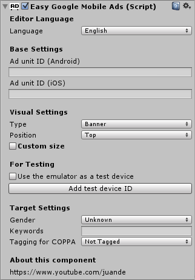

# EasyGoogleMobileAds for Unity #

Add a banner into any scene of you game without typing any code.

View the [spanish](https://github.com/jjjuande/EasyGoogleMobileAds/blob/master/README.md) versión of this document.

## Descarga ##

Click [**here**](https://github.com/jjjuande/EasyGoogleMobileAds/releases/download/v0.9.10/EasyGoogleMobileAds-0.9.10.unitypackage) to download the latest version of this asset.

## Guide of use ##

**Requirements:** For this asset to work, you should have correctly installed the [Google Mobile Ads](https://github.com/googleads/googleads-mobile-plugins/tree/master/unity) Unity plugin on your project.

### Banners ###

To add a banner into any scene, you just have to drag the **EasyGoogleMobileAds** prefab into the scene hierarchy.

Then, you just have to set its inspector values. The **Ad Unit ID** for the specified platform is required.

### Banners - Show/Hide Banner ###

The banner (enabled/disabled) state is related to the state of the **EasyGoogleMobileAds** game object. While it is active in the hierarchy, the banner will be running and visible. If not, the banner won't be running and won't be displayed.

    // "banner" is a reference to the
    // EasyGoogleMobileAds game object
    ...
    // To hide (deactivate) the banner
    banner.SetActive(false);
    // To show (activate) the banner
    banner.SetActive(true);
 
### Banners - Events ###

The events are useful when we want to run some code when something happens related to the banner. To do this: Create a new script, then copy all the events you are interested on, and add your code to these events. (You have an example script with all the available events on  _/Assets/EasyGoogleMobileAds/ExampleScripts/AdEventBehaviour.cs_.) To finish, add your script as a component to the **EasyGoogleMobileAds** game object. Every time an event happens, the propper method will be executed.

These method don't receive any parameter:
* **OnAdLoaded**. Called when an ad request has successfully loaded.
* **OnAdOpened**. Called when an ad is clicked.
* **OnAdLeftApplication**. Called when the ad click caused the user to leave the application.
* **OnAdClosing**. Called when the user is about to return to the app after an ad click.
* **OnAdClosed**. Called when the user returned from the app after an ad click.

This is the only method that receives a parameter: *errorMessage*, which will contain the error message.
* **OnAdFailedToLoad**: Called when an ad request failed to load. Remember to cast *errorMessage* to _string_ befor using it.

### Interstitials ###

The ID for the test devices must be set just when your game starts.

    string[] testDeviceIDs = new string[]{"E92E9A6745B85439C2EA180AB0010A87"};
    EasyGoogleMobileAds.GetInterstitialManager().SetTestDevices(true, testDeviceIDs);

It's not mandatory, but you can also set the ad targeting options as shown below. _(This code must also be run just when your game starts.)_

    // Adding keywords
    string[] keywords = new string[]{"ropa", "compras", "moda"};
    EasyGoogleMobileAds.GetInterstitialManager ().SetKeywords (keywords);
    // Setting the gender
    EasyGoogleMobileAds.GetInterstitialManager ().SetGender (GoogleMobileAds.Api.Gender.Male);
    // Set the tag for child directed treatment to false (or true)
    // If you don't know how this option must be used, don't use it.
    EasyGoogleMobileAds.GetInterstitialManager ().TagForChildDirectedTreatment (false);
    
The following code will initialize the interstitial with the given Ad Unit ID. You must add it just after the code above, and at the beggining of the game.  _(This will prepare the ad to be shown downloading it. It won't display any interstitial. Keep reading.)_

    EasyGoogleMobileAds.GetInterstitialManager().PrepareInterstitial("ca-app-pub-XXXXXXXXXXXXXXXX/XXXXXXXXXX");

Use this line **every time** you want to show the interstitial. _(This line won't do anything while there is no available ad to show. The ad needs some time to be downloaded between the call to Prepareinterstitial and ShowInterstitial, and between calls to ShowInterstitial. When the interstitial is shown, the next ad will be downloaded.)_

    EasyGoogleMobileAds.GetInterstitialManager().ShowInterstitial();

### Intersticiales - Events ###

These are the events fired by the interstitials:
* **OnAdLoaded**. The ad is finished downloading and is ready to be shown. _(It won't be shown until the method ShowInterstitial is executed.)_
* **OnAdOpened**. The interstitial is shown.
* **OnAdClosing**. The user is about to return the game after the inerstitial is shown.
* **OnAdClosed**. The user returns to the game after the interstitial is shown.
* **OnAdLeftApplication**. The user clicks on the interstitial ad.
* **OnAdFailedToLoad**: There's been an error downloading the ad to be displayed.

The following code must be executed after calling _PrepareInterstitial_. If you execute it before, you'll get a _NullPointerException_.

This is an example of code block that gets executed when the event _OnAdLoaded_ is fired:

    EasyGoogleMobileAds.GetInterstitialManager().GetInterstitial().OnAdLoaded = 
    delegate(){
        // Here is the code you want to run when the event OnAdLoaded happens.
        // ...
    };

This also works for the events_OnAdOpened_, _OnAdClosing_, _OnAdClosed_, _OnAdClosed_ y  _OnAdLeftApplication_. You just have to replace _OnAdLoaded_ with the event name you need. You can repeat this code block as many times as events you want to use.

Here is the code for when there's an error downloading the ad. _(It's different from the other block because of it receives the error message.)_ 

    EasyGoogleMobileAds.GetInterstitialManager().GetInterstitial().OnAdFailedToLoad = 
    delegate(string mensaje){
        // Here is the code you want to run when the event OnAdfailedToLoad happens.
        // Note you have the error message in the "message" parameter.
        // ...
    };

## Important notice ##

You **shouldn't** use the click events to give the users extra coins, digital goods or any advantage. Remember: You shouldn't encourage users to click on the ads.

## Licencia de uso ##

**EasyGoogleMobileAds** is *free software*; You can distribute and/or modify it under the [MIT license terms](https://github.com/jjjuande/EasyGoogleMobileAds/blob/master/LICENSE). It's distributed in the hope that it will be useful, but WITHOUT ANY WARRANTY; without even the implied warranty of MERCHANTABILITY or FITNESS FOR A PARTICULAR PURPOSE.

The source code is freely available from GitHub. You may want to check it out and download latest release. In case you find a bug, you can report it [here](https://github.com/jjjuande/EasyGoogleMobileAds/issues).

## For more information (in spanish) ##

I made a full course (in spanish) about AdMob and this asset on [this playlist](https://www.youtube.com/playlist?list=PLREdURb87ks2uIXmTOAVvnOz0JV2-ZwHH) from my [Youtube channel](https://www.youtube.com/juande).

