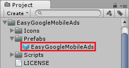
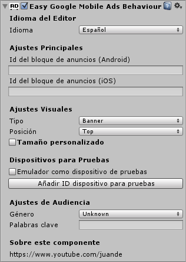

# EasyGoogleMobileAds for Unity#

Prefab que permite colocar banners de Admob en Unity sin escribir una sola línea de código.

## Descarga ##

Descárgalo [**desde aquí**](https://github.com/jjjuande/EasyGoogleMobileAds/releases/download/v0.9.7/EasyGoogleMobileAds-0.9.7.unitypackage).

## Resumen de uso ##

**Importante:** Para que este prefab funcione, tienes que instalar previamente el plugin de [Google Mobile Ads] (https://github.com/googleads/googleads-mobile-plugins/tree/master/unity) siguiendo las instrucciones de la página de ese proyecto.

### Banners ###

Para hacer que aparezca un banner en una determinada escena, sólo tienes que colocar el prefab **EasyGoogleMobileAds** en la jerarquía de objetos de esa escena.

Después sólo tendrás que configurarlo en el inspector de Unity. Para que funcione, tendrás que especificar como mínimo el **Id del bloque de anuncios** (Ad unit ID)

### Banners - Ocultar/Mostrar Banner ###

El objeto **EasyGoogleMobileAds** hará que se muestre un banner de publicidad mientras este objeto permanezca activo en la jerarquía. Así que lo normal es que el banner permanezca activo durante toda la escena. Si durante algún momento se quisiera ocultar el banner sin tener que cambiar de escena, sólo habría que desactivar el objeto **EasyGoogleMobileAds**.

    // El código siguiente supone que "banner" está 
    // referenciando al objeto EasyGoogleMobileAds
    ...
    // Para desactivarlo
    banner.SetActive(false);
    // Para activarlo
    banner.SetActive(true);
 
### Banners - Interceptar eventos ###

Puede haber veces en donde queramos ejecutar cierto código una vez que el banner se ha cargado, o si se le ha hecho clic en el mismo. Para ello, créate un nuevo script copiando el contenido del script _/Assets/EasyGoogleMobileAds/ExampleScripts/AdEventBehaviour.cs_ y añádelo como componente al objeto **EasyGoogleMobileAds**. Cada vez que ocurra un evento, se ejecutará el método correspondiente.

Estos son los que no reciben ningún parámetro:
* **OnAdLoaded**. El anuncio se ha terminado de cargar.
* **OnAdOpened**. El usuario ha hecho clic en el anuncio.
* **OnAdClosing**. El usuario está a punto de volver a la aplicación después de hacer clic en el anuncio.
* **OnAdClosed**. El usuario vuelve a la aplicación después de hacer clic en el anuncio.
* **OnAdLeftApplication**. Cuando el clic en el anuncio hace que el usuario deje la aplicación.

Este es el único que recibe como parémtro *errorMessage* el mensaje de error:
* **OnAdFailedToLoad**: Cuando ha ocurrido un error cargando el anuncio. Recuerda hacer un casting a string a la variable *errorMessage* antes de usarla.

### Intersticiales ###

Recomiendo establecer los IDs de dispositivos de prueba nada más iniciarse tu juego. 
_(Por ejemplo, en el Start de la cámara de la escena inicial)_

    string[] testDeviceIDs = new string[]{"E92E9A6745B85439C2EA180AB0010A87"};
    EasyGoogleMobileAds.GetInterstitialManager().SetTestDevices(true, testDeviceIDs);

Si quieres, puedes añadir los parámetros de segmentación para los anuncios de los intersticiales como se describe a continuación. _(No será obligatorio indicar ningún parámetro de los que se describen. Así que todo este siguiente bloque de código será opcional)_

    // Añadimos las keywords que definen el contenido de la publicidad que se mostrara
    string[] keywords = new string[]{"ropa", "compras", "moda"};
    EasyGoogleMobileAds.GetInterstitialManager ().SetKeywords (keywords);
    // Indicamos que la publicidad sea dirigida a hombres (por ejemplo)
    EasyGoogleMobileAds.GetInterstitialManager ().SetGender (GoogleMobileAds.Api.Gender.Male);
    // Indicamos que no se haga un trato especial para niños con la publicidad mostrada.
    EasyGoogleMobileAds.GetInterstitialManager ().TagForChildDirectedTreatment (false);
    
Justo después de las líneas anteriores, usa la siguiente para preparar el intersticial pasándole tu adUnitID. 
_(Se iniciará la descarga del anuncio que se mostrará.)_

    EasyGoogleMobileAds.GetInterstitialManager().PrepareInterstitial("ca-app-pub-XXXXXXXXXXXXXXXX/XXXXXXXXXX");

Usa la siguiente línea cada vez que quieras mostrar el insterticial.
_(Esta línea no hace nada mientras no se haya terminado de descargar el anuncio y esté disponible. Una vez mostrado, se iniciará la descarga del siguiente anuncio que se mostrará.)_

    EasyGoogleMobileAds.GetInterstitialManager().ShowInterstitial();

## Licencia de uso ##

**EasyGoogleMobileAds** es *software libre*; puedes redistribuirlo y/o modificarlo bajo los términos de licencia MIT. Se distribuye con la esperanza de que sea útil, pero SIN NINGUNA GARANTÍA. Para más información, léete el archivo LICENSE.

## Información más completa ##

Para conocer todo sobre este prefab y el plugin oficial de Google, accede a [esta lista de reproducción](https://www.youtube.com/playlist?list=PLREdURb87ks2uIXmTOAVvnOz0JV2-ZwHH) de mi [canal de Youtube](https://www.youtube.com/juande).

